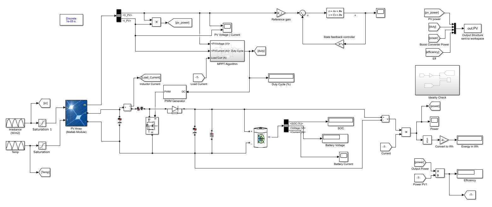

# PV Dynamic Model
MATLAB | Simulink project where a photovoltaic generator system is modelled directly. Both a temperature and irradiance distribution is fed into a Solar Array module from Matlab. The positive and negative terminals feed into a boost converter electrical circuit, and the digital outputs are used for two purposes. The digital output array voltage and current are used to determine appropriate cycle based upon an MPPT algorithm. The duty cycle then feeds to a PWM signal generator and back to a MOSFET in the boost converter circuit. It should be noted that the electrical circuit terminates at a battery. The digital outputs are also fed into a state-feedback controller mimicking a charge controller. Altogether, several PV generator parameter system variables are monitored, and this framework can act as a useful tool for designing such a system

Note the entire model below

To run the 120 second simulation, one must first run either 'statespace_ackerman_setup.m' or 'statespaceLQRsetup.m'. Both similarly initialize workspace variables, but determine the controller feedback gain differently.

'passiveparams_overVin&Iin.m' and 'passive_parameters_overduty.m' can be used to determine appropriate sizing for electrical circuit elements.
